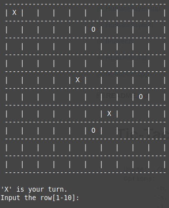

# Tic-Tac-Toe Game

```
Usage: ./tic-tac-toe <option(s)>
Options:
	-h,--help		Show this help message
	-s,--size SIZE	Specify the size of the board (default = 3)
	-l,--line LENGTH	Specify the length of the line to win (default = 3)
```


